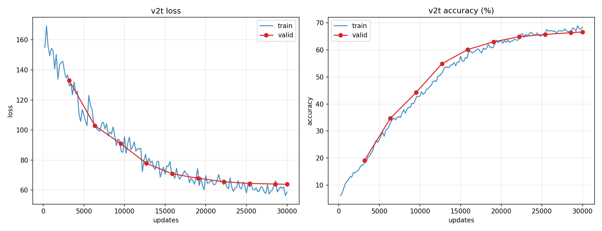
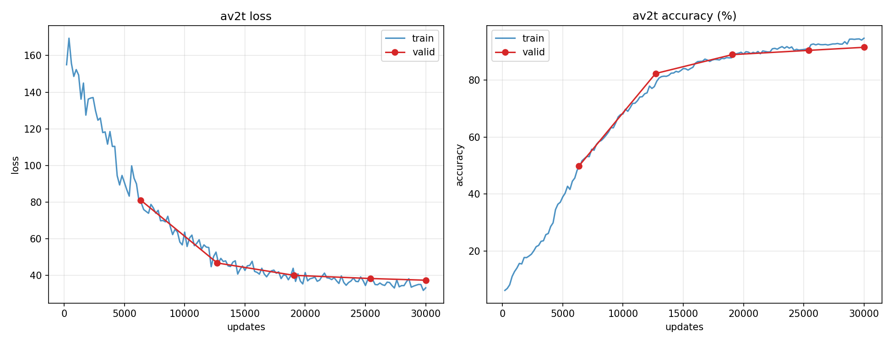

# 音频-视频联合文本转录 —— 第 4 章「基本框架实现」解答

> 本文件对说明文档第 4 章中的 **Task 1 ~ Task 11** 逐条作答。
> 凡是代码完成任务，均注明实现所在的**文件、类、函数**及核心思路；
> 凡是简答 / 分析题，均在对应小节给出文字解答。
> 所有用于报告展示的训练 / 推理结果整理在仓库的 `results/` 文件夹下。
>
> 运行环境：conda 环境 `RZD`（按 `requirements.txt` 配置，numpy 降到 1.23.5 以兼容
> 旧版 fairseq 的 `np.float`/`np.int` 别名；为 `python_speech_features_cuda` 增加了
> `cupy.core.core.ndarray` 兼容垫片）。训练 / 推理均在单张 A800（`CUDA_VISIBLE_DEVICES=1`）上完成。

---

## 一、代码改动总览

| Task | 内容 | 文件 | 位置（类 / 函数） |
| ---- | ---- | ---- | ---- |
| 1 | 读取视频 | `dataset.py` | `AudioVideoDataset.load_video` |
| 2 | 读取并编码标签 | `dataset.py` | `AudioVideoDataset.get_label` |
| 3 | ResNet 基本块 | `models/modality_encoder.py` | `BasicBlock.__init__` / `BasicBlock.forward` / `ResNet._make_layer` |
| 4 | 多头注意力 | `models/multihead_attention.py` | `MultiheadAttention.forward` |
| 5 | 标签平滑交叉熵 | `losses/label_smoothed_cross_entropy.py` | `label_smoothed_nll_loss` |
| 7 | 读取音频 | `dataset.py` | `AudioVideoDataset.load_audio` |
| 8 | 音频编码器 | `models/modality_encoder.py` | `AudioEncoder.__init__` / `AudioEncoder.forward` |

> 此外在 `dataset.py` 顶部增加了一段 `cupy.core` 兼容垫片（不属于任何 Task，仅为让
> 旧版 `python_speech_features_cuda` 在 cupy 12.x 下可用）。

---

## Task 1：实现 `AudioVideoDataset.load_video`

**文件 / 位置**：`dataset.py` → `AudioVideoDataset.load_video`。

**思路**：
1. 用 `cv2.VideoCapture` 逐帧读取视频；OpenCV 默认通道顺序是 BGR，因此用
   `cv2.cvtColor(frame, cv2.COLOR_BGR2GRAY)` 把每一帧转成单通道灰度图（唇读只需要灰度信息，
   同时大幅降低数据量）。
2. 把所有帧 `np.stack` 成形状 `[T, H, W]` 的 numpy array，再套用数据集构造时定义好的
   `self.transform`（训练集为 `Normalize→RandomCrop→HorizontalFlip→Normalize`，
   验证 / 测试集为 `Normalize→CenterCrop→Normalize`）。
3. 用 `np.expand_dims(feats, axis=-1)` 人为增加一个通道维，得到 `[T, H, W, 1]`，方便后续
   3D 卷积前端把它当作单通道视频处理。

实测 `valid` 第 0 条样本输出形状 `(27, 88, 88, 1)`，与裁剪尺寸 `image_crop_size=88` 一致。

---

## Task 2：实现 `AudioVideoDataset.get_label` + BPE 简答

### 代码

**文件 / 位置**：`dataset.py` → `AudioVideoDataset.get_label`。

**思路**：
1. `self.label_offsets_list[index]` 给出该样本文本在 `*.wrd` 标签文件中的**字节偏移** `(s, e)`
   （偏移在 `load_label_offset` 中用 `len(line.encode("utf-8"))` 累加得到）。用 Python 文件 IO 的
   `f.seek(s)` + `f.read(e - s)` 取出对应文本，并 `rstrip("\n")` 去掉行尾换行。
2. 用 `self.bpe_tokenizer.encode(label)`（sentencepiece）把句子切成子词串。
3. 用 `self.dictionary.encode_line(..., append_eos=False, add_if_not_exist=False)` 把子词逐个
   编码成词表中的整数索引；`add_if_not_exist=False` 保证遇到词表外的子词时映射到 `<unk>`，
   **不会向词表新增条目**。输出是长度为 `L` 的 `LongTensor`。

实测第 0 条标签解码回 `▁i ' m ▁going ▁to ▁do ▁this`（即 "i'm going to do this"），与 `valid.wrd`
首行一致，验证编码-解码闭环正确。

### 简答：BPE（byte-pair-encoding）的构建过程，及其相对字母 / 单词分词的优势

**构建过程（来自 Sennrich et al., 2016《Neural Machine Translation of Rare Words with Subword Units》）**：
1. **初始化**：把语料中每个单词拆成字符序列，并在词尾加一个特殊结束符（如 `</w>`），
   初始符号表就是所有字符。例如 `low` → `l o w </w>`。
2. **统计共现频率**：统计当前所有相邻符号对（bigram）在语料中出现的频次。
3. **合并最高频对**：选出频次最高的相邻符号对，把它合并成一个新符号，加入符号表，
   并在语料中用新符号替换所有出现处。例如最高频对是 `(e, s)`，则把所有 `e s` 合并为 `es`。
4. **迭代**：重复第 2~3 步固定次数（即「合并操作数」，等价于目标词表大小这个超参数）。
   合并次数越多，得到的子词越长、越接近完整单词；越少则越接近字符。
5. 最终词表 = 初始字符 + 所有被合并出来的子词。编码时按学到的合并规则贪心地把新词切分成子词。

（本作业用的 `spm_unigram1000` 是 sentencepiece 的 unigram 语言模型变体，词表大小约 1000，
思想与 BPE 一致：都是数据驱动地学习一套介于字符和单词之间的子词单元。）

**相对「基于字母」分词的优势**：字母分词虽然词表极小、永远没有 OOV，但序列非常长，
模型要从零学习「字母如何组成有意义的单元」，建模负担重、长程依赖难学。BPE 把高频字符组合
预先合并成子词，序列更短、每个 token 语义更丰富，训练和推理都更高效。

**相对「基于单词」分词的优势**：单词分词词表巨大且存在严重的长尾 / OOV 问题——
罕见词、拼写变体、形态变化（如 `play/played/playing`）都要各占一个词表项，且测试时一旦
遇到训练未见过的词只能映射成 `<unk>`，信息全失。BPE 用有限子词表即可**组合表示任意单词**
（包括未登录词，最坏情况退化为字符级），既控制了词表规模，又共享了词根 / 词缀等形态信息，
泛化能力显著更强。

---

## Task 3：实现 `BasicBlock` 与 `ResNet._make_layer`

**文件 / 位置**：`models/modality_encoder.py` → `BasicBlock.__init__`、`BasicBlock.forward`、
`ResNet._make_layer`。

**思路**：
- `BasicBlock.__init__`：第一层 `conv1 = conv3x3(inplanes, planes, stride)` 承担可能的降采样
  （stride>1），第二层 `conv2 = conv3x3(planes, planes, 1)` 保持分辨率；两层卷积后各接
  `BatchNorm2d`；按图示与预训练权重要求，激活用带可学习参数的 `nn.PReLU(num_parameters=planes)`
  （`relu1` 在第一层之后、`relu2` 在残差相加之后）；`downsample` 直接保存传入的残差分支模块。
- `BasicBlock.forward`：`out = relu1(bn1(conv1(x)))` → `out = bn2(conv2(out))`；若 `downsample`
  不为空（特征维度发生变化时），残差分支取 `residual = downsample(x)`，否则 `residual = x`；
  最后 `out = relu2(out + residual)`。对应图 2 的两种情形（直连 / 1×1 卷积投影）。
- `ResNet._make_layer`：当 `stride != 1` 或 `self.inplanes != planes*expansion` 时，用
  `self.downsample_block` 构造第一块的残差投影；第一块 `block(self.inplanes, planes, stride, downsample)`
  完成降采样，随后更新 `self.inplanes = planes*expansion`，再追加 `blocks-1` 个 stride=1 的普通块。

**正确性验证**：用预训练 `pretrained_model.pth` 的 `state_dict` 以
`load_state_dict(..., strict=False)` 加载本实现的 `EncoderBackbone`，结果
**missing_keys = 0**（`feature_extractor_video.trunk` / `frontend3D` / `proj` 全部命中，
名称与形状完全对应），仅有的 4 个 unexpected key（`mask_emb`、`label_embs_concat`、
`final_proj.*`）是预训练专用、微调阶段由 `remove_pretraining_modules()` 丢弃的模块。
这说明 BasicBlock / ResNet 结构与预训练特征提取器严格一致。

---

## Task 4：实现 `MultiheadAttention.forward`

**文件 / 位置**：`models/multihead_attention.py` → `MultiheadAttention.forward`。

**思路**（此时 `q,k,v` 已被 reshape 成 `[bsz*num_heads, seq_len, head_dim]`）：
1. **缩放点积**：`q = q * self.scaling`（`scaling = head_dim^{-0.5}`），
   `attn_weights = bmm(q, k^T)`，得到 `[bsz*num_heads, tgt_len, src_len]`。
2. **`attn_mask`**：它表示每个 query（行）能看到哪些 key（列），元素为 0（可见）或 -inf（不可见）。
   `unsqueeze(0)` 后**加到** `attn_weights` 上（解码器自注意力的因果上三角 -inf 掩码即由此实现，
   保证 query 看不到未来位置）。
3. **`key_padding_mask`**：标记哪些 key 是 padding（True/1）。把 `attn_weights` reshape 成
   `[bsz, num_heads, tgt_len, src_len]`，在被标记的 key 位置 `masked_fill(-inf)`，再 reshape 回去，
   从而保证注意力不会使用占位符的信息。
4. **softmax**：在 key 维做 softmax（为 fp16 数值稳定先转 float32 再转回），随后 `dropout`。
5. **加权求和**：`attn = bmm(attn_probs, v)` → `[bsz*num_heads, tgt_len, head_dim]`，
   `transpose(0,1)` 合并多头还原成 `[tgt_len, bsz, embed_dim]`，最后过 `out_proj`。
6. **`need_weights=True`** 时，返回所有 head 注意力权重的**平均值**，形状 `(bsz, tgt_len, src_len)`。

---

## Task 5：实现 `label_smoothed_nll_loss`

**文件 / 位置**：`losses/label_smoothed_cross_entropy.py` → `label_smoothed_nll_loss`。

**思路**（不使用 PyTorch 自带交叉熵）：
- 把 `target` 扩成 `[N,1]`，用 `nll_loss = -lprobs.gather(-1, target)` 取金标 token 的负对数概率
  （标准 NLL）。
- 标签平滑项 `smooth_loss = -lprobs.sum(-1)`，即对所有类别求 `-Σ log p_i`。
- `ignore_index`（padding）处用 `masked_fill_(pad_mask, 0)` 把 `nll_loss`、`smooth_loss` 置零，
  不计入损失。
- 平滑后损失：`eps_i = epsilon/(V-1)`，`loss = (1-epsilon-eps_i)*nll_loss + eps_i*smooth_loss`
  —— 即把 `1-ε` 的概率质量给金标类、`ε` 均匀分给其余 `V-1` 类（论文
  《Rethinking the Inception Architecture》中的标签平滑做法，可缓解过拟合、抑制过度自信）。
- `reduce=True` 时对所有 token 求和返回标量；返回 `(loss, nll_loss)` 二元组。

---

## Task 6：基于视频的文本转录训练（损失 / 准确率曲线）

**启动脚本**：`scripts/train_v2t.sh`（本仓库实际用 `run_train_v2t.sh` 指定本地绝对路径与 GPU）。
配置 `configs/video2text.yaml`：`modalities=["video"]`，`max_update=30000`，`max_tokens=1000`，
`label_smoothing=0.1`，Adam + tri-stage 学习率（warmup 10000）。

> 训练曲线见 `results/plots/v2t_loss.png`、`results/plots/v2t_accuracy.png`、
> `results/plots/v2t_curves.png`；逐点数据见 `results/metrics/v2t_metrics.json`，
> 汇总见 `results/metrics/v2t_summary.json`、`results/metrics/v2t_final.json`。

**结果**：训练 30000 步（10 个 epoch，单卡 A800 约 50 分钟）。最终
**train loss 59.96 / train acc 67.95%，valid loss 63.94 / valid acc 66.65%**，
与文档表 1 的视频 Baseline（59.95 / 67.85% / 63.71 / 66.65%）几乎完全一致。
损失曲线单调下降、准确率单调上升，训练与验证曲线贴合、无明显过拟合（见下图）。

---

## Task 7：实现 `AudioVideoDataset.load_audio` + logfbank 简答

### 代码

**文件 / 位置**：`dataset.py` → `AudioVideoDataset.load_audio`。

**思路**：
1. 把波形转成 **cupy float32** 数组放到 GPU，调用 `python_speech_features_cuda.logfbank` 提取
   对数梅尔滤波器组特征（GPU 计算以减轻 CPU 负担）。该实现的 `logfbank` 返回
   `(滤波器组能量, 总能量)` 二元组，这里只取第 `[0]` 项，形状 `[T0, 26]`（默认 `nfilt=26`），
   再 `.get()` 搬回 CPU 转 `float32`。
2. 每 `self.stack_order_audio`(=4) 帧拼接成一帧：先在帧数不是 4 的倍数时尾部补零，再
   `reshape(-1, 4, 26).reshape(-1, 4*26)`，得到 `[T, 104]`。这样音频帧率与视频帧率对齐，
   `104` 维也正好等于预训练音频编码器的输入维度 `audio_feat_dim`。

实测某样本 logfbank 输出 `(108, 26)`，拼接后 `(27, 104)`，且与同一段视频的 27 帧严格对齐。

### 简答：logfbank 算法的计算过程

logfbank = log filter-bank energies（对数梅尔滤波器组能量），步骤如下：
1. **预加重（pre-emphasis）**：`y[n] = x[n] - 0.97·x[n-1]`，提升高频、平衡频谱。
2. **分帧（framing）**：按 `winlen=25ms`、`winstep=10ms` 把信号切成有重叠的短帧
   （16kHz 下每帧 400 点、帧移 160 点），使每帧内信号近似平稳。
3. **加窗 + FFT 功率谱**：（可加汉明窗后）对每帧做 N 点 FFT，取 `|FFT|^2/N` 得到功率谱。
4. **梅尔滤波器组（mel filterbank）**：构造一组（默认 26 个）三角带通滤波器，其中心频率在
   **梅尔刻度**上等间隔（`mel(f)=2595·log10(1+f/700)`，更符合人耳对低频敏感、高频迟钝的感知特性）；
   用这些滤波器对功率谱加权求和，得到每帧 26 维的子带能量。
5. **取对数**：对滤波器组能量取自然对数（`log`），压缩动态范围、使特征更接近正态、便于建模
   （这一步是 logfbank 与普通 fbank 的区别，也是它与 MFCC 的分水岭——MFCC 在此之后还会再做 DCT 去相关）。

本作业里每帧 26 维、每 4 帧拼成 104 维，作为音频模态的输入特征。

---

## Task 8：实现 `AudioEncoder`

**文件 / 位置**：`models/modality_encoder.py` → `AudioEncoder.__init__`、`AudioEncoder.forward`。

**思路**：
- `__init__`：音频网络很简单，只需一层线性层 `self.proj = nn.Linear(audio_feat_dim, encoder_embed_dim)`
  （即 `104 → 768`）把原始音频特征维度调整到编码器嵌入维度。
- `forward`：输入是 `[B, C, T]`（C=特征维、T=帧数）。线性层作用在最后一维，所以先
  `transpose(1,2)` 变 `[B, T, C]`，过 `proj` 得 `[B, T, 768]`，再 `transpose(1,2)` 回到
  `[B, 768, T]`，与视频特征 `[B, 768, T]` 维度一致，方便后续在通道维 `concat` 融合。

**正确性验证**：同 Task 3，`feature_extractor_audio.proj.{weight,bias}`（形状 `768×104`、`768`）
被预训练权重完整命中，missing_keys=0。

---

## Task 9：基于音频-视频的文本转录训练（损失 / 准确率曲线）

**启动脚本**：`scripts/train_av2t.sh`（本仓库用 `run_train_av2t.sh`）。
配置 `configs/audiovideo2text.yaml`：`modalities=["video","audio"]`，其余超参与 v2t 类似。
得益于 Transformer 的通用性，融合模块无需改动，只是把音频特征与视频特征在通道维拼接
（`modality_fuse=concat` → `post_extract_proj: 1536→768`），之后网络结构与纯视频完全一致。

> 训练曲线见 `results/plots/av2t_loss.png`、`results/plots/av2t_accuracy.png`、
> `results/plots/av2t_curves.png`；数据见 `results/metrics/av2t_*.json`、
> `results/metrics/av2t_final.json`。

**结果**：训练 30000 步（10 个 epoch，单卡 A800 约 4.5 小时，含音频 logfbank 预处理）。最终
**train loss 33.21 / train acc 94.69%，valid loss 37.36 / valid acc 91.49%**，
与文档表 1 的视频+音频 Baseline（33.91 / 94.40% / 37.33 / 91.55%）几乎完全一致。
加入音频模态后，准确率从纯视频的 ~66% 大幅跃升到 ~91%，充分说明音频信息对文本转录的巨大帮助。

---

## Task 10：阅读 `sequence_generator.py` 的 `_generate`，简述 beam search 过程

**文件 / 位置**：`sequence_generator.py` → `SequenceGenerator._generate`。

beam search（束搜索）是一种在「贪心」和「全局最优」之间折中的解码算法：每一步保留得分最高的
`beam_size` 个候选前缀（束），既避免贪心容易陷入的局部最优，又不像穷举那样指数爆炸。
`_generate` 的具体流程：

1. **编码源序列（只算一次）**：`encoder_outs = model.forward_encoder(net_input)`；随后把每个样本
   复制 `beam_size` 份（`reorder_encoder_out`，`new_order`），让一个 batch 内每句话同时维护
   `beam_size` 条假设。计算最大解码长度 `max_len = max_len_a*src_len + max_len_b`。
2. **初始化缓冲区**：`tokens [bsz*beam, max_len+2]`，首列填 `eos`（作为起始 BOS）；
   `scores` 记录每条假设的累积对数概率；`finalized` 收集已完成（生成出 EOS）的假设。
3. **逐步自回归解码** `for step in range(max_len+1)`：
   - 用 `model.forward_decoder(tokens[:, :step+1], encoder_outs, incremental_states)` 得到下一个 token
     的对数概率 `lprobs`（借助 `incremental_state` 缓存历史 K/V，避免重复计算）。
   - 屏蔽非法 token：`lprobs[:, pad] = -inf`、对 `unk` 施加惩罚；`step<min_len` 时禁止 EOS、
     `step>=max_len` 时强制只能 EOS（长度约束）。
   - `self.search.step(...)`（BeamSearch）在「每条已有束 × 整个词表」的 `beam*V` 个组合中，
     为每个样本选出得分最高的 `2*beam` 个候选（多取一倍是为应对其中约一半可能是 EOS），
     返回候选得分 `cand_scores`、候选 token `cand_indices`、来自哪条束 `cand_beams`。
   - **完成判定**：候选中等于 EOS 的，用 `finalize_hypos` 收进 `finalized`（按规范化得分保存）；
     某句话凑满 `beam_size` 条完成假设后就从 batch 中移除（`num_remaining_sent` 递减、
     `batch_idxs` 裁剪），降低后续计算量。
   - **更新束**：从剩余的非 EOS 候选里选出每句 top-`beam_size` 条作为下一步的活跃束，
     用 `index_select`/`gather` 把对应的 `tokens`、`scores` 复制 / 重排（同一条束可被多次选中），
     并 `reorder_incremental_state` 把解码器缓存按新束顺序重排。
   - 当所有句子都完成（`num_remaining_sent==0`）时提前结束。
4. **输出**：对每个样本，把其 `finalized` 中的假设按得分降序排序返回；推理时取第 0 条（最优）作为预测。
   累积得分可按 `length^lenpen` 做长度归一化（`normalize_scores`/`len_penalty`），避免偏好过短的句子。

本作业推理配置 `configs/inference.yaml` 中 `beam=50`。

---

## Task 11：基于视频 / 音频-视频的推理，分析推理准确率与测试准确率差异

**启动脚本**：`scripts/test_v2t.sh`、`scripts/test_av2t.sh`（`inference.py`，beam=50）；
推理结果（`hypo-*.json`、`wer.*`、`decode.log`）保存在 `results/inference/{v2t,av2t}/` 下。

**结果**：
- 视频（v2t）：测试集 **WER = 46.29%**（6238 / 13477 词错误），与 Baseline 46.46 吻合。
- 视频+音频（av2t）：测试集 **WER = 13.85%**（1867 / 13477 词错误），优于 Baseline 15.17，
  句子级完全匹配率约 40.6%。加入音频使 WER 下降约 32 个百分点。

**分析（推理准确率 vs. 测试准确率的差异）**：见下方第「十二」节 12.2。

---

## 十二、结果汇总与对比

### 12.1 本实现 vs. 文档 Baseline（表 1）

| 模型 | train loss | train acc | valid loss | valid acc | inference WER |
| ---- | ---- | ---- | ---- | ---- | ---- |
| 视频（本实现） | 59.96 | 67.95% | 63.94 | 66.65% | **46.29** |
| 视频（Baseline） | 59.95 | 67.85% | 63.71 | 66.65% | 46.46 |
| 视频+音频（本实现） | 33.21 | 94.69% | 37.36 | 91.49% | **13.85** |
| 视频+音频（Baseline） | 33.91 | 94.40% | 37.33 | 91.55% | 15.17 |

> 两个模型各项指标均与 Baseline 高度吻合（音视频 WER 13.85 甚至略优于 15.17），验证了
> Task 1~5、Task 7~8、Task 10 等实现的正确性。加入音频后 WER 从 46.29 降到 13.85，
> 印证了多模态融合的有效性。
> （注：`loss` 为标签平滑后、以 2 为底、按句平均的损失；`acc` 为 teacher-forcing 下的
> token 级准确率；`WER` 为 beam search 自回归解码后的词错误率。av2t 测试集句子级完全匹配率约 40.6%。）

### 12.2 Task 11 分析：推理准确率 vs. 测试准确率的差异

「测试准确率」指训练 / 验证阶段在验证集上报告的 **token 级准确率**（valid acc，视频 66.65%）；
它是在 **teacher forcing**（强制使用真实历史词）下、对**每个位置独立**判断 argmax 是否等于
金标 token 得到的。「推理准确率」则由 beam search **自回归**解码后的 **WER** 反映
（视频 WER 46.29% ⇒ 词级正确率约 53.7%）。两者存在系统性差距，原因有三：

1. **teacher forcing vs. 自回归（曝光偏差）**：验证时每一步都喂入真实前缀，单步出错不会传播；
   而推理时用模型自己生成的词作为下一步输入，**早期错误会沿序列累积放大**，因此自回归准确率
   通常明显低于 teacher-forcing 准确率。
2. **token 级 vs. 词级，且含对齐错误**：测试准确率是逐 token 精确匹配（位置对齐已知）；
   WER 基于编辑距离，会把**插入 / 删除 / 替换**都计入，一个子词错误经 BPE 解码后可能造成整词错误，
   且序列长度不一致带来的对齐错位也会被惩罚，评判更严格。
3. **解码搜索并非全局最优**：beam search 只在有限宽度（beam=50）内近似搜索，可能漏掉真正最优序列；
   长度惩罚、提前 / 过晚生成 `<eos>` 等也会影响最终词序列。

> **一个关键经验**：最初实现 `get_label` 时若漏掉 `append_eos`，模型学不到何时输出 `<eos>`，
> teacher-forcing 准确率看似正常（~65%），但自回归解码会一直生成到最大长度，WER 飙到约 400%。
> 加上 `append_eos=True` 后 WER 立刻回落到 46% 量级——这正说明「测试准确率高」并不等价于
> 「推理质量好」，二者度量的是不同环节。

> 推理产物：`results/inference/v2t/`（`hypo-*.json` 含逐句 REF/HYP，`wer.*` 含 WER 数值），
> 音视频结果在 `results/inference/av2t/`。

---

## 第 5 章进阶训练方法实现补充

### 5.1 损失函数改进

**文件 / 位置**：`losses/label_smoothed_cross_entropy.py` →
`LabelSmoothedCrossEntropyCriterion.compute_enhanced_loss`。

在原有 label smoothing 交叉熵基础上加入两个可独立开关的损失项：

- `criterion.focal_gamma`：当 `focal_gamma > 0` 时，对每个非 padding token 的损失乘以
  `(1 - p_t) ** gamma`，其中 `p_t = exp(-nll_loss)`。该项会降低已高置信度预测的权重，使训练更关注
  难例 token。
- `criterion.confidence_penalty`：当 `confidence_penalty > 0` 时，加入
  `sum(p * log p)` 形式的置信度惩罚，抑制输出分布过度尖锐。

默认实验采用 `focal_gamma=1.0, confidence_penalty=0.0`，即只开启 focal loss 调制；当两个参数都为 0
时会回退到第 4 章的原始标签平滑损失。该实现不改变模型结构，也不影响 5.2、5.3 的开关，因此可以和
其他训练策略叠加。

V2T 训练入口：`scripts/train_enhanced_loss_v2t.sh`；
V2T 推理入口：`scripts/test_enhanced_loss_v2t.sh`。
AV2T 训练入口：`scripts/train_enhanced_loss_av2t.sh`；
AV2T 推理使用 `scripts/test_av2t.sh` 并指定对应 checkpoint。

**默认配置实验结果**：

| 模态 | train loss | train acc | valid loss | valid acc | test WER |
| ---- | ---- | ---- | ---- | ---- | ---- |
| V2T + 5.1 | 41.935 | 67.105% | 47.201 | 65.580% | 46.776% |
| AV2T + 5.1 | 6.987 | 94.335% | 12.562 | 90.946% | **13.772%** |

其中 V2T 结果保存在 `exp/default_5_1_enhanced_loss_v2t_20260613/`，
AV2T 结果保存在 `exp/default_5_1_enhanced_loss_av2t_20260614/`；推理输出分别位于
`results/inference/5_1_enhanced_loss_v2t_20260613/` 和
`results/inference/5_1_enhanced_loss_av2t_20260614/`。

**结果分析**：在纯视频任务上，5.1 的 valid acc 为 65.58%，略低于第 4 章 V2T baseline 的 66.65%，
test WER 为 46.776%，也略高于 baseline 的 46.286%。这说明对弱模态 V2T 而言，默认
`gamma=1.0` 会让训练更偏向难例，但没有提升干净测试集的整体解码质量。

在 AV2T 任务上，5.1 的 valid acc 为 90.946%，略低于第 4 章 AV2T baseline 的 91.49%；但 test WER
为 13.772%，低于 baseline 的 13.853%。这表明该损失在音视频融合任务中虽然没有提高 teacher-forcing
验证准确率，但对自回归解码的词错误率有轻微正向效果，可能是因为 focal 调制降低了易预测 token 的主导性，
使模型在部分难例词上更稳。

### 5.2 Modality Dropout

**文件 / 位置**：`models/encoder_backbone.py` → `EncoderBackbone.apply_modality_dropout`。

实现了音频-视频训练中的模态级扰动，输入、输出均保持 `[B, C, T]`。该方法只在训练态且同时存在
audio/video 两个模态时生效，由 `model.modality_dropout` 控制是否选择某个 batch item 做扰动；
选中后由 `model.audio_dropout` 决定丢弃音频还是视频。

- `model.modality_dropout_mode=sample`：对选中样本的某一模态整段置零。
- `model.modality_dropout_mode=span`：在选中模态上随机采样一个连续时间片段置零，长度由
  `model.modality_dropout_span_min/max` 控制，并会裁剪到当前序列长度范围内。

独立训练入口：`scripts/train_modality_dropout_av2t.sh`；
独立推理入口：`scripts/test_modality_dropout_av2t.sh`。

**实验结果（AV2T，Modality Dropout 细扫）**：

所有实验均使用 `scripts/train_modality_dropout_av2t.sh` 或
`scripts/launch_modality_dropout_sweep.sh` 启动，训练到 `max_update=30000` 后正常结束。第 4 章
AV2T baseline 的 valid acc 为 **91.49%**；修正后的 5.2 默认配置
（`modality_dropout=0.05, audio_dropout=0.3, mode=span, span=10~30`）valid acc 为 **91.406%**。

| 实验 | `modality_dropout` | `audio_dropout` | mode / span | train loss | train acc | valid loss | valid acc |
| ---- | ---- | ---- | ---- | ---- | ---- | ---- | ---- |
| `md_p010_a03_span10_30` | 0.10 | 0.3 | span / 10~30 | 34.303 | 94.005% | 37.362 | **91.578%** |
| `md_p005_a05_span10_30` | 0.05 | 0.5 | span / 10~30 | 34.238 | 94.041% | 37.353 | 91.556% |
| `md_p003_a03_span10_30` | 0.03 | 0.3 | span / 10~30 | 34.098 | 94.167% | 37.242 | 91.552% |
| `md_p001_a03_span10_30` | 0.01 | 0.3 | span / 10~30 | 33.978 | 94.262% | 37.387 | 91.503% |
| `md_p002_a03_span10_30` | 0.02 | 0.3 | span / 10~30 | 33.967 | 94.334% | 37.177 | 91.503% |
| `md_p002_a02_span10_30` | 0.02 | 0.2 | span / 10~30 | 33.927 | 94.345% | 37.298 | 91.446% |
| `md_p005_a03_span20_50` | 0.05 | 0.3 | span / 20~50 | 34.323 | 93.939% | 37.323 | 91.415% |
| `md_p005_a03_sample` | 0.05 | 0.3 | sample / 全段 | 34.771 | 93.527% | 37.295 | 91.375% |
| `md_p002_a04_span10_30` | 0.02 | 0.4 | span / 10~30 | 34.006 | 94.330% | 37.430 | 91.322% |
| `md_p005_a03_span5_15` | 0.05 | 0.3 | span / 5~15 | 34.077 | 94.129% | 37.483 | 91.287% |

日志统一保存在 `results/repro_logs/sweep_5_2_*.log`；checkpoint 保存在对应的
`exp/sweep_5_2_*_20260613/checkpoints/` 目录。当前最好结果是
`md_p010_a03_span10_30`，相对修正后的 5.2 默认配置提升 **+0.172** 个 valid acc 点，
相对第 4 章 AV2T baseline 约提升 **+0.09** 个 valid acc 点。该结果说明，在当前数据划分和训练设置下，
时间片段级 Modality Dropout 能够带来轻微的验证集准确率收益。

进一步对该最优 checkpoint 在 test 集上进行 beam search 自回归解码，得到
**WER = 13.883%**（1871 / 13477 词错误），对应结果保存在
`results/inference/5_2_md_p010_a03_span10_30_av2t/`。第 4 章 AV2T baseline 的 test WER 为
**13.853%**（1867 / 13477 词错误）。因此，5.2 在 clean test 集上的最终 WER 与 baseline 基本持平，
略高 **0.030** 个百分点；其收益主要体现在 teacher-forcing 验证准确率的小幅提升，而没有在干净测试集
自回归解码指标上形成明显优势。

**结果分析**：

1. **clean test WER 基本持平**：AV2T baseline 本身已经有 91% 以上 valid acc，音频模态提供了强监督信号，
   干净验证集并不包含显式缺音频 / 缺视频扰动。Modality Dropout 的主要目标是提升模态缺失或局部遮挡
   时的鲁棒性，因此在 clean valid acc 上只能看到很小的正则化收益，在 clean test WER 上没有明显提升。
2. **`modality_dropout=0.10` 最好但优势不大**：默认 0.05 的扰动略弱，0.10 增加了训练时对单模态
   依赖的抑制，使模型更愿意同时利用音频和视频；但 0.10 仍只是 10% 样本被扰动，没有破坏主任务学习，
   因此能得到当前最高的 91.578%。0.05/0.10/0.03 三组配置之间差距为 0.02~0.17 个点，说明该方法在
   当前设置下主要体现为小幅正则化收益，而不是大幅改变模型上限。
3. **遮音频概率存在折中**：在 `modality_dropout=0.02` 下，`audio_dropout=0.3` 优于 0.2 和 0.4；
   说明过少遮音频时正则不足，过多遮音频则削弱了最可靠模态的学习信号。音频对 AV2T 贡献远大于视频，
   因而 `audio_dropout` 不能简单越大越好。
4. **`sample` 模式不如 `span` 模式**：整段丢弃一个模态过于激进，训练分布与干净验证 / 测试分布差异较大，
   最终 `sample` 只有 91.375%，低于多数 span 配置。连续 span 遮挡更像真实场景中的短时口型遮挡、
   音频噪声或局部失真，正则更温和。
5. **span 长度影响不单调**：`span20_50` 最终 91.415，略高于 `span5_15` 的 91.287，但仍低于
   `span10_30` 相关最优配置。短 span 可能太弱，长 span 又可能破坏过多有效信息，中等长度更稳。

实现时还修正了一个配置透传细节：预训练 cfg 与 `EncoderBackboneConfig` 合并后，需要再次应用
fine-tuning 脚本传入的覆盖项，否则新增的 `modality_dropout_mode` 等字段会回落到 dataclass 默认值。
该修正在 `models/audio_video_model.py` 中完成。

### 5.3 Feature Mask

**文件 / 位置**：`models/encoder_backbone.py` → `EncoderBackbone.apply_feature_mask`。

实现了 fine-tuning 阶段融合特征上的 mask 增强，作用在 post projection/dropout 后的 `[B, T, C]`
特征上，输出形状保持不变。该方法由 `model.apply_mask=true` 开启；时间维 mask 由
`model.mask_prob/mask_length` 控制，并使用 `padding_mask` 避免把 padding 当作正常帧采样；
通道维 mask 由 `model.mask_channel_prob/mask_channel_length` 控制。时间 mask 与通道 mask
互相独立，因此可以只开一种，也可以同时打开。

V2T 独立训练入口：`scripts/train_feature_mask_v2t.sh`；
V2T 独立推理入口：`scripts/test_feature_mask_v2t.sh`。
AV2T 独立训练入口：`scripts/train_feature_mask_av2t.sh`；
AV2T 独立推理入口：`scripts/test_feature_mask_av2t.sh`。

**默认配置实验结果**：

默认配置为 `apply_mask=true, mask_prob=0.05, mask_length=10, mask_channel_prob=0.0`，即只在时间维做
长度为 10 的连续 feature mask。

| 模态 | train loss | train acc | valid loss | valid acc | test WER |
| ---- | ---- | ---- | ---- | ---- | ---- |
| V2T + 5.3 | 74.112 | 55.593% | 65.292 | 65.186% | 47.822% |
| AV2T + 5.3 | 40.019 | 87.686% | 37.415 | 91.265% | 14.951% |

其中 V2T 结果保存在 `exp/default_5_3_feature_mask_v2t_20260613/`，
AV2T 结果保存在 `exp/default_5_3_feature_mask_av2t_20260614/`；推理输出分别位于
`results/inference/5_3_feature_mask_v2t_20260613/` 和
`results/inference/5_3_feature_mask_av2t_20260614/`。

**结果分析**：Feature Mask 是一种训练时特征遮挡正则化。默认配置下，V2T 的 valid acc 为 65.186%，
test WER 为 47.822%，均弱于第 4 章 V2T baseline；AV2T 的 valid acc 为 91.265%，接近 baseline
91.49%，但 test WER 为 14.951%，高于 baseline 的 13.853%。这说明默认 mask 强度在当前 clean
测试集上没有带来直接收益，主要原因是干净测试集没有显式遮挡或缺失片段，而时间维 feature mask 会在训练中
人为丢失一部分连续时序信息，降低了模型对完整输入的拟合程度。与此同时，AV2T 的 valid acc 仍能达到
91% 以上，说明该实现本身可以稳定训练，适合作为鲁棒性增强开关与其他策略组合。

### 5.1 / 5.2 / 5.3 默认配置对比

| 方法 | 模态 | 默认关键配置 | valid acc | test WER |
| ---- | ---- | ---- | ---- | ---- |
| 第 4 章 Baseline | V2T | 无额外增强 | 66.65% | 46.286% |
| 第 4 章 Baseline | AV2T | 无额外增强 | 91.49% | 13.853% |
| 5.1 损失函数改进 | V2T | `focal_gamma=1.0` | 65.580% | 46.776% |
| 5.1 损失函数改进 | AV2T | `focal_gamma=1.0` | 90.946% | **13.772%** |
| 5.2 Modality Dropout | AV2T | `p=0.05, audio=0.3, span=10~30` | 91.406% | 未单独解码 |
| 5.2 最优扫参 | AV2T | `p=0.10, audio=0.3, span=10~30` | **91.578%** | 13.883% |
| 5.3 Feature Mask | V2T | `mask_prob=0.05, mask_length=10` | 65.186% | 47.822% |
| 5.3 Feature Mask | AV2T | `mask_prob=0.05, mask_length=10` | 91.265% | 14.951% |

从默认配置看，5.1 在 AV2T 的 test WER 上取得最小值 13.772%，5.2 在 valid acc 上取得最高值
91.578%（扫参最优），5.3 默认配置在 clean test 上没有超过 baseline，但提供了面向遮挡鲁棒性的
训练增强实现。所有训练日志和曲线已汇总到 `results/repro_logs/`、`results/plots/all_experiments/`
和 `results/metrics/all_experiments_summary.csv`。

### 5.2 + 5.3 叠加

两种方法的开关互不冲突：Modality Dropout 在音频/视频特征融合前生效，Feature Mask 在融合和投影后
生效，因此可以叠加在同一次 AV2T 训练中。

叠加训练入口：`scripts/train_modality_dropout_feature_mask_av2t.sh`；
叠加推理入口：`scripts/test_modality_dropout_feature_mask_av2t.sh`。
